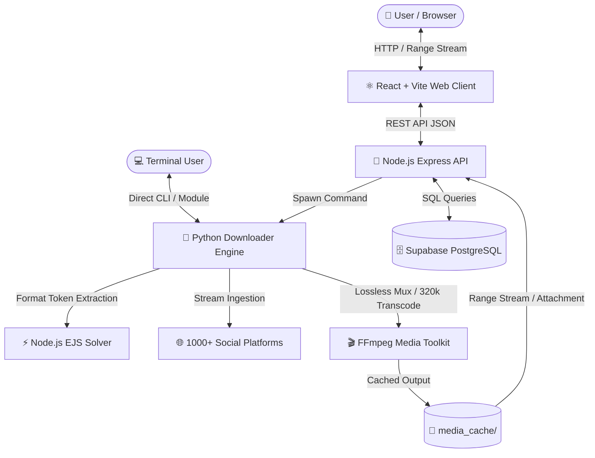

# ⚡ Master Downloader

<p align="center">
  
</p>

<p align="center">
  <strong>Universal 4K/8K Video, 320 kbps MP3 Audio & Full-Resolution Image Downloader</strong>
</p>

<p align="center">
  
  
  
  
</p>

---

## 📖 Description

**Master Downloader** is a high-performance, full-stack media extraction suite and standalone CLI tool designed to download videos, audio, and images at their **highest original fidelity**. Powered by an optimized **yt-dlp** engine and **FFmpeg** pipeline, it losslessly retrieves content across **YouTube, Instagram (Reels, Posts, Stories, Carousels), TikTok, Facebook, Twitter/X, Reddit, Vimeo, Twitch, Pinterest**, and 1,000+ websites.

Whether through its modern glassmorphic web dashboard or its interactive terminal interface, Master Downloader bypasses resolution throttling, decrypts protected formats via Node.js JavaScript runtimes, and delivers pristine MP4 videos, 320 kbps MP3 tracks, and uncompressed high-resolution images.

---

## 🖥️ Screenshots / Demo

### 🌐 Web Dashboard Preview
```text
+-------------------------------------------------------------------------------+
|  ⚡ Master Downloader           [ Home ]  [ History Log ]  [ About ]   (•) API: Online |
+-------------------------------------------------------------------------------+
|                                                                               |
|                            Master Downloader                                  |
|     Download ultra HD 4K videos, 320kbps MP3s & full-res photos from 1000+ sites|
|                                                                               |
|  [ 🔗 Paste YouTube, Instagram, TikTok, Reddit, or X link...     ] [ FETCH ]  |
|                                                                               |
|  [📺 YouTube]  [📸 Instagram]  [🎵 TikTok]  [👥 Facebook]  [🐦 X]  [🤖 Reddit] |
|                                                                               |
|  +-------------------------------------------------------------------------+  |
|  |  [ ▶️ 4K Live Preview Player ]  |  Rick Astley - Never Gonna Give You Up   |  |
|  |                              |  ⏱️ 3:33  •  👤 Rick Astley             |  |
|  |                              |  Resolution: 3840x2160 (4K Ultra HD)     |  |
|  |                              |  Quality: [ 2160p (4K Ultra HD)  ▼ ]     |  |
|  |                              |  [ 📥 Download Video (Best Quality)    ] |  |
|  +-------------------------------------------------------------------------+  |
+-------------------------------------------------------------------------------+
```

### 💻 Interactive CLI Preview
```bash
$ python downloader.py

============================================================
🌐  Universal Social Media Downloader (Max Quality)
   Supports: YouTube, Instagram, TikTok, Facebook, Twitter/X, Reddit, ...
   Powered by yt-dlp & FFmpeg (4K / 1080p / MP3 / Full-Res Images)
============================================================

Choose an option:
  1. Download video/media (Highest Quality / 4K / 1080p)
  2. Download audio only (320 kbps MP3)
  3. Batch download (multiple links)
  4. Change download directory
  5. Exit

Enter option (1-5): 1
Enter media link: https://www.youtube.com/watch?v=dQw4w9WgXcQ
📥 Parsing: https://www.youtube.com/watch?v=dQw4w9WgXcQ
📹 Title: Rick Astley - Never Gonna Give You Up (Official Video) (4K Remaster)
👤 Author: Rick Astley
⏱️  Duration: 213 seconds
📂 Downloading highest quality available...
  Progress: 100.0% | Speed: 14.8MiB/s | ETA: 00:00
✅ Download complete: ./downloads/Rick Astley - Never Gonna Give You Up.mp4
```

---

## ✨ Features

- 🎬 **True Maximum Video Fidelity**: Unlocks full 4K UHD (2160p), 2K QHD (1440p), and 1080p 60fps streams with lossless FFmpeg audio/video muxing.
- 🎵 **High-Definition Audio Extraction**: Converts any video or audio stream into studio-grade **320 kbps CBR MP3** files.
- 📸 **Full-Resolution Image & Carousel Support**: Downloads 100% original uncompressed photos from Instagram, Reddit albums, TikTok slideshows, and Twitter/X.
- 🌐 **1000+ Platforms Supported**: YouTube, Instagram, TikTok, Facebook, Twitter/X, Reddit, Vimeo, Twitch, Dailymotion, Bilibili, and more.
- ⚡ **Zero Re-Encoding Quality Loss**: Uses direct stream remuxing rather than lossy transcoding to preserve source bitrates.
- 🔓 **JavaScript Challenge Solver (`node` + `ejs:github`)**: Decrypts YouTube signatures and tokens, preventing format degradation and 360p fallback.
- 🍪 **Browser Cookie Authentication**: Supports extraction of private, age-restricted, or follower-only media via Chrome/Firefox/Edge cookies.
- 🎮 **In-Browser Streaming Player**: Full HTTP Byte-Range support (`206 Partial Content`) for instant playback, seeking, and live preview.
- 🎛️ **Granular Quality Selector**: Choose between Maximum 4K/8K, 1440p, 1080p, 720p, 480p, 360p, or 320kbps MP3.
- 📦 **Dual Interface**: Use the full-stack web UI or the lightweight Python CLI & importable module.

---

## 🛠️ Tech Stack

### Frontend
- **Framework**: React 18 with Vite
- **Styling**: Vanilla CSS Design System (Custom Glassmorphism, Neon Glow Tokens, CSS Grid/Flexbox)
- **Icons & Visuals**: Custom Vector SVG Logo & Platform Badges
- **Audio/Video Playback**: Native HTML5 Media with Range Streaming

### Backend & Core Services
- **Runtime**: Node.js (ESModules & CommonJS)
- **Web Framework**: Express.js
- **Process Orchestration**: Node.js `child_process.spawn` executing Python Core
- **Database & Logs**: Supabase PostgreSQL / Custom Request Logger
- **Security Middleware**: CORS, Helmet, Express-Rate-Limit

### Media Engine
- **Engine**: Python 3.12
- **Core Library**: `yt-dlp` (configured with Node.js EJS challenge solver)
- **A/V Processing**: `FFmpeg` (Stream Muxing, Audio Transcoding)

---

## 🏛️ Project Architecture



---

## 📥 Installation

### 1. Clone the Repository
```bash
git clone https://github.com/your-username/master-downloader.git
cd master-downloader
```

### 2. Install System Prerequisites

#### A. Install Python & Python Dependencies
Ensure Python 3.8+ is installed, then run:
```bash
pip install -r requirements.txt
```

#### B. Install FFmpeg
FFmpeg is required to merge separate video and audio streams losslessly:
- **Windows**:
  ```powershell
  winget install Gyan.FFmpeg
  # Or download from https://ffmpeg.org/download.html and add bin to PATH
  ```
- **macOS**:
  ```bash
  brew install ffmpeg
  ```
- **Linux (Ubuntu/Debian)**:
  ```bash
  sudo apt update && sudo apt install ffmpeg
  ```

#### C. Install Backend Dependencies
```bash
cd backend
npm install
```

#### D. Install Frontend Dependencies
```bash
cd ../frontend
npm install
```

---

## ⚙️ Configuration

Create a `.env` file inside the `/backend` directory based on `.env.example`:

```env
# Backend Server Configuration
PORT=10000
NODE_ENV=development
FRONTEND_URL=http://localhost:5173

# Optional: Browser Cookies for Private / Age-Restricted Content ('chrome', 'firefox', 'edge')
YT_DLP_COOKIES_BROWSER=

# Optional: Supabase Database Configuration (Defaults to Mock in-memory if omitted)
SUPABASE_URL=your_supabase_project_url
SUPABASE_KEY=your_supabase_anon_or_service_key
```

---

## 🚀 Usage

### 1. Running the Full-Stack Web Application

#### Start the Backend API (Port 10000)
```bash
cd backend
npm run dev
```

#### Start the Frontend Client (Port 5173)
```bash
cd frontend
npm run dev
```
Open your browser at `http://localhost:5173` to access the Master Downloader interface.

---

### 2. Running the Interactive CLI Tool
From the root project directory:
```bash
python downloader.py
```

---

### 3. Using as a Python Module in Your Own Code
```python
from downloader import download_media, download_batch

# 1. Download highest quality video (up to 4K)
download_media("https://www.youtube.com/watch?v=VIDEO_ID")

# 2. Download at specific resolution (e.g. 1080p, 720p)
download_media(
    "https://www.instagram.com/reel/ABC123/",
    output_dir="./my_videos",
    quality="1080p",
    custom_name="my_reel"
)

# 3. Extract 320 kbps MP3 Audio
download_media("https://www.youtube.com/watch?v=VIDEO_ID", audio_only=True)

# 4. Batch Download Multiple URLs
urls = [
    "https://www.youtube.com/watch?v=VIDEO_1",
    "https://www.tiktok.com/@user/video/123456",
    "https://www.reddit.com/r/videos/comments/xyz/post",
]
download_batch(urls, quality="best")
```

---

### 4. API Endpoints

| Method | Endpoint | Description |
| :--- | :--- | :--- |
| `POST` | `/api/download` | Analyzes URL, returns available formats, resolutions, and stream IDs |
| `GET` | `/api/download/stream` | Streams video/audio with HTTP 206 Partial Content Range support |
| `GET` | `/api/download/file` | Triggers native attachment file download (`.mp4`, `.mp3`, `.jpg`) |
| `GET` | `/api/history` | Retrieves recent download request log entries |
| `GET` | `/api/health` | Health check and database connection status |

---

## 📁 Folder Structure

```text
downloader-gb,insta,tiktok/
├── backend/
│   ├── src/
│   │   ├── controllers/         # Express route controllers (download, history)
│   │   ├── database/            # Supabase / DB client configuration
│   │   ├── middleware/          # Rate limiting, error handling, validation
│   │   ├── routes/              # Express API route declarations
│   │   ├── services/
│   │   │   ├── media.service.js # Media cache management & orchestration
│   │   │   ├── platform.service.js # Platform detection logic
│   │   │   ├── url.service.js   # URL sanitizer & normalization
│   │   │   └── video_engine.py  # High-performance yt-dlp Python core
│   │   ├── utils/               # Structured Winston logger
│   │   ├── validators/          # URL & platform regex validators
│   │   └── server.js            # Express application entry point
│   ├── .env.example             # Backend environment template
│   └── package.json
├── frontend/
│   ├── public/
│   │   ├── favicon.svg          # Master Downloader Favicon
│   │   └── logo.svg             # Master Downloader Vector Shield Logo
│   ├── src/
│   │   ├── assets/              # Static styling assets
│   │   ├── components/          # Reusable UI components (Navbar, ResultCard, etc.)
│   │   ├── pages/               # Views (Home, History, About, Terms, Privacy)
│   │   ├── services/            # Frontend API client
│   │   ├── App.jsx              # Main React application
│   │   └── index.css            # Custom glassmorphic design system
│   ├── index.html
│   ├── package.json
│   └── vite.config.js
├── database/
│   ├── schema.sql               # PostgreSQL tables (requests, history, users)
│   └── seed.sql                 # Sample test data
├── tests/
│   └── backend/
│       └── backend.test.js      # Backend unit test suite
├── downloader.py                # Standalone CLI & importable Python module
├── requirements.txt             # Python dependencies (yt-dlp)
├── README.md                    # Project documentation
└── LICENSE                      # MIT License
```

---

## 🔒 Security Features

- **SSRF & Command Injection Protection**: Strict regex validation on all input URLs before passing to execution layers.
- **Path Traversal Shield**: Sanitized filename generators strip out malicious directory separators (`../`, `\`, null bytes).
- **DDoS & Spam Mitigation**: Configured `express-rate-limit` to restrict excessive rapid requests per IP.
- **Isolated Process Spawning**: Python tasks execute in subshells with validated, non-concatenated argument arrays.
- **Safe Content Headers**: Helmet security middleware sets strict `X-Content-Type-Options`, `X-Frame-Options`, and Content Security Policies.

---

## 🧪 Testing

Run the automated backend unit test suite:
```bash
node tests/backend/backend.test.js
```

Verify Python syntax and engine integrity:
```bash
python -c "import downloader; import backend.src.services.video_engine; print('✅ All engines verified successfully!')"
```

---

## 🔮 Future Improvements

- [ ] **Cloud Object Storage**: S3/R2 integration for optional cloud caching and CDN distribution.
- [ ] **Batch ZIP Downloads**: One-click download of full image carousels or video playlists as a single `.zip` file.
- [ ] **Browser Extension**: Chrome & Firefox companion extension for one-click downloads directly on social media sites.
- [ ] **Webhooks**: Notification support when background batch exports finish processing.

---

## 📄 License

Distributed under the **MIT License**. See `LICENSE` for details.

---

## 👤 Author / Contact

- **Project Lead**: Master Downloader Team
- **Issues & Contributions**: Open a pull request or issue on [GitHub Issues](https://github.com/your-username/master-downloader/issues).
